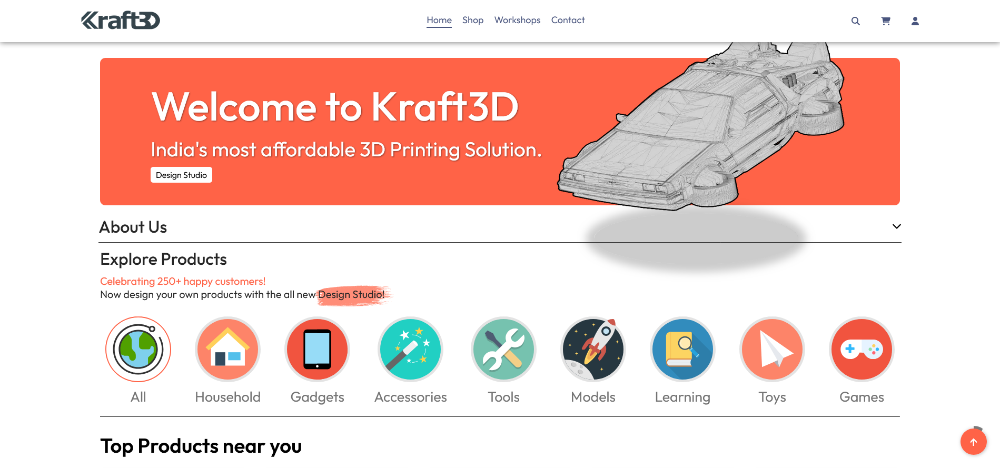
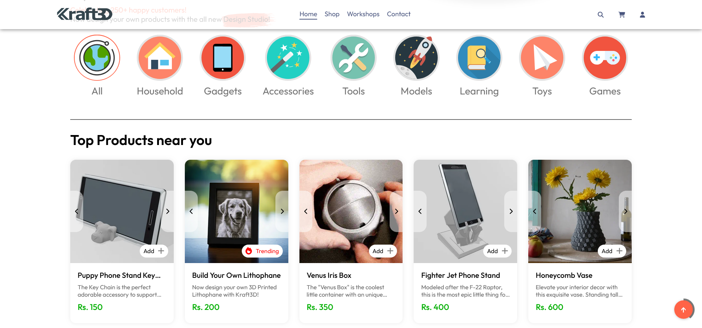
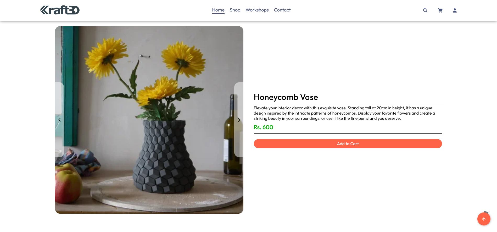
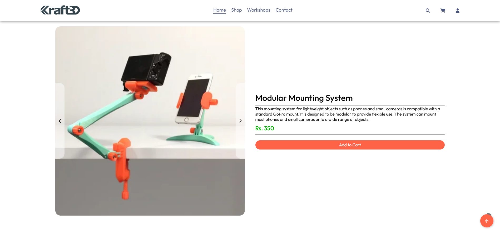
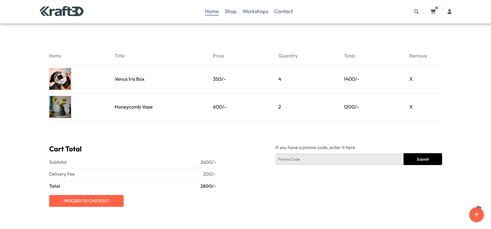
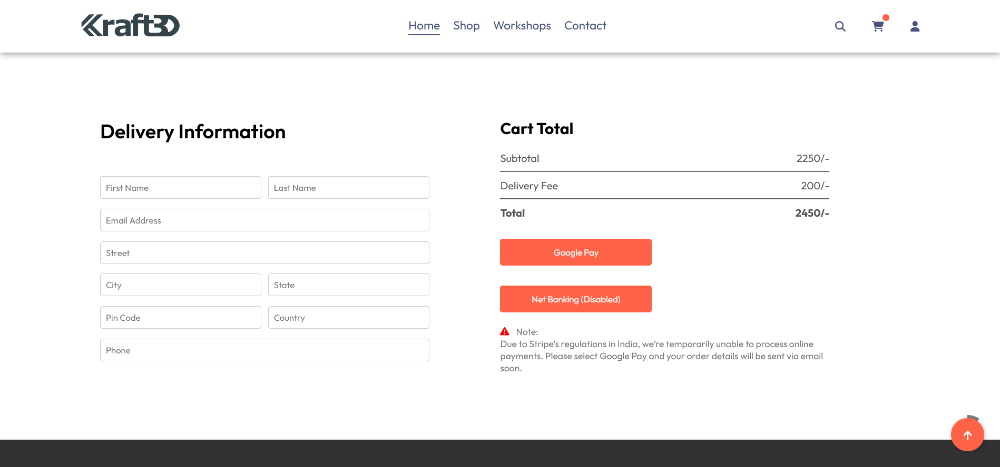
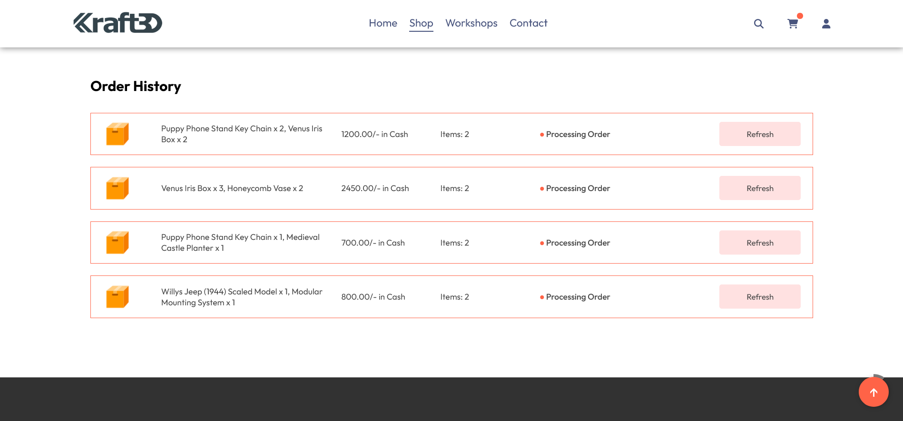
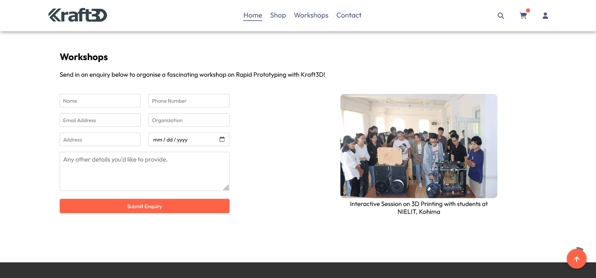
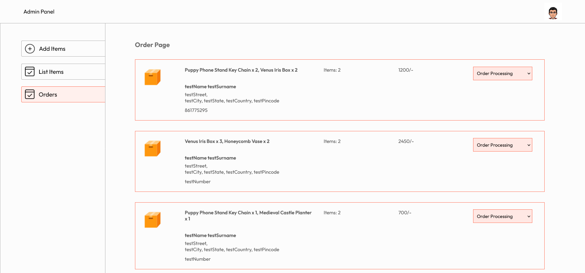
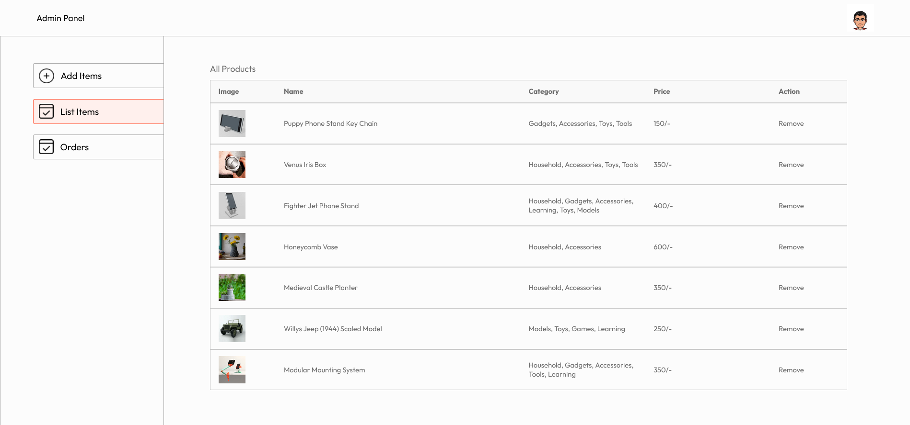

# Kraft3D @ [kraft3D.com](https://kraft3d.rudraneeldutta.com)

Welcome to **Kraft3D** — India's most affordable e-commerce platform for my range of high-quality 3D-printed products. Explore the shop [here](https://kraft3d.rudraneeldutta.com).

## 📖 Project Overview

Kraft3D is designed to provide an intuitive shopping experience with:
- A unique landing page showcasing featured products
- A diverse product catalog with all available items
- Filters to find just the right things
- Visit each product's page for a complete description
- Add things to your cart and checkout seamlessly
- View your orders and track their status
- Book a workshop with me and schedule training sessions on 3D printing

Additionally, Kraft3D includes an **Admin Console** for managing everything on my end.

---

## 🌐 Pages and Features

| Landing Page | All Products |
|--------------|--------------|
|  |  |

| Product Page | Product Page |
|--------------|--------------|
|  |  |

| Cart | Checkout |
|------|----------|
|  |  |

| Orders Page | Workshop Booking |
|-------------|------------------|
|  |  |

| Admin Console - Order Management | Admin Console - Product Management |
|----------------------------------|------------------------------------|
|  |  |

---

## ⚙️ Tech Stack

Kraft3D is built with focus on performance, maintainability, and scalability.

### **Frontend**

- **React**: The website’s frontend is developed with **React** to create a dynamic and responsive user interface.

### **Backend**

- **Node.js & Express**: The server side is powered by **Node.js** with **Express** for routing and handling API requests. All core operations, including product listings, orders, user authentication, and workshop bookings, are managed through RESTful API endpoints.

- **MongoDB**: A **MongoDB** database is utilized for storing and retrieving data. Collections include products, users, orders, and bookings, structured to support rapid access and updates.

- **JWT Authentication**: Using **JWT (JSON Web Tokens)**, all user data is encrypted when performing sensitive operations.

Kraft3D is a high-performance, scalable e-commerce solution optimized for both users and administrators.

---

**Check it out @ [kraft3D.com](https://kraft3d.rudraneeldutta.com)**!
